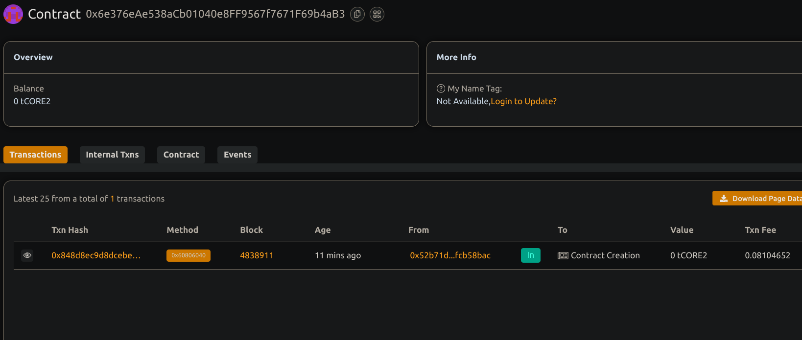

# Basic Auction System

## Project Title
**Basic Auction System with Time Constraints**

## Project Description
This project presents a decentralized auction platform built on the Ethereum blockchain using Solidity. It enables users to conduct time-bound auctions for physical or digital assets with transparent bidding and automatic determination of winners.

Each auction operates within a specific timeframe, defined by clear start and end times. Sellers can initiate auctions by specifying item details, starting price, and duration. Buyers place bids during the active period, with the system managing bid increments and issuing refunds to outbid participants.

The smart contract governs the entire auction lifecycle—from creation and bidding to completion and fund distribution. All transactions occur on-chain, ensuring transparency and eliminating the need for intermediaries.

## Project Vision
The goal of this system is to establish a transparent, efficient, and accessible auction marketplace where participants can engage with confidence. By utilizing blockchain technology, the system addresses critical issues in traditional auctions, such as bid manipulation, rule violations, and disputes.

Key benefits include:
- Transparency through immutable records
- Global participation
- Trustless execution via smart contracts
- Automated settlement post-auction

Ultimately, this system seeks to democratize the auction experience, making it open to anyone with internet access while maintaining fairness and market-driven price discovery.

## Key Features
- **Time-Bounded Auctions**: Auctions run within defined start and end times  
- **Automatic Bidding Management**: Tracks and updates highest bids automatically  
- **Trustless Operation**: Smart contract enforces rules without third-party involvement  
- **Transparent Bid History**: All bid data is publicly recorded on the blockchain  
- **Automatic Settlement**: Funds are automatically transferred upon auction completion  
- **Outbid Refunds**: Outbid users can withdraw their previous bids  
- **Multiple Concurrent Auctions**: Supports simultaneous auctions  
- **Seller Controls**: Sellers can customize auction parameters and confirm delivery  
- **Detailed Auction Information**: Public access to comprehensive auction data  
- **Event Notifications**: Key actions trigger events for front-end integration  

## Future Scope
- **Reserve Prices**: Minimum required price for a sale to occur  
- **Auction Extensions**: Extend auction end time if last-minute bids are placed  
- **Proxy Bidding**: Set maximum bids with automatic incremental increases  
- **Buy Now Option**: Instant purchase alternative  
- **Escrow Mechanism**: Secure handling of funds for physical items  
- **Auction Categories**: Improved browsing via categorized listings  
- **Reputation System**: Ratings to assess buyer/seller reliability  
- **Auction Templates**: Ready-to-use settings for common auction types  
- **Scheduled Auctions**: Auto-start future auctions  
- **Fee Structure**: Platform fees for sustainability  
- **Bidding Increments**: Minimum bid step enforcement  
- **Mobile Application**: User-friendly interface for mobile users  
- **Integration with NFTs**: Support for non-fungible token auctions  
- **Auction Analytics**: Performance statistics and insights. 

## Contract Details
**Contract Address:** `0x6e376eAe538aCb01040e8FF9567f7671F69b4aB3` 

